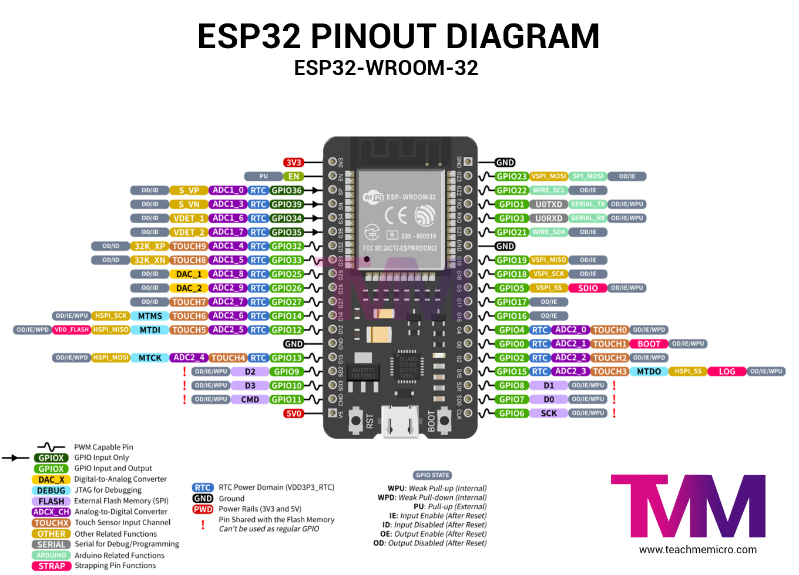

# ESP-32 Assignment Submission

### Written by Gaurav Khaire

ESP32-PINOUT: 
  

References Used: 
> 1. https://lastminuteengineers.com/creating-esp32-web-server-arduino-ide/
> 2. https://github.com/espressif/esp-idf/tree/master/examples/wifi/softap_sta
> 3. https://www.w3schools.com/html/html_layout.asp
  